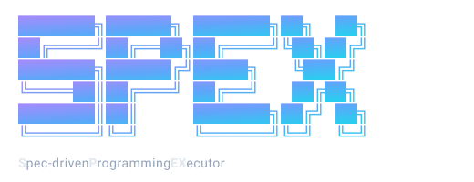

<p align="center">
  
</p>

<p align="center">
  <a href="https://github.com/rogcg/spex/actions/workflows/ci.yml"></a>
  <a href="https://github.com/rogcg/spex/releases/latest"></a>
  <a href="./LICENSE"></a>
</p>

# SPEX

**Spec-driven Programming EXecutor**

> AI agent orchestration framework for software development, based on versioned specs and human approval gates.

> 🚧 **Work in progress — not production ready.** SPEX is an early-stage experimental project. It is **not** ready for production use or real-life applications. APIs may change without warning, flows that depend on external services (Linear, PostHog, Slack) have rough edges, and there is no support guarantee. Use it to explore the ideas, hack on it, give feedback — not to run anything you care about. Pin to a specific tag if you want any kind of reproducibility.

See [`CLAUDE.md`](./CLAUDE.md) for the architectural decisions and code conventions, and [`CHANGELOG.md`](./CHANGELOG.md) for the per-release diff.

## Detailed docs

| Doc | What it covers |
|---|---|
| [`docs/cli-reference.md`](./docs/cli-reference.md) | Every `spex` subcommand — arguments, flags, env vars, exit codes, examples. |
| [`docs/configuration.md`](./docs/configuration.md) | Full `.ai/config.yaml` schema for every integration (GitHub, Linear, PostHog, Slack), including defaults and validation rules. |
| [`docs/discovery-and-techspec.md`](./docs/discovery-and-techspec.md) | The adaptive discovery flow, the decision-gate engine, stack recommendation, scaffold planner / verifier / self-correction. |
| [`docs/audit-and-resume.md`](./docs/audit-and-resume.md) | `.ai/scratch/` and `.ai/audit/` layout, workflow lifecycle, crash recovery, conflict resolution, audit event schema, secret redaction. |
| [`docs/github-workflows.md`](./docs/github-workflows.md) | The GitHub Actions templates installed by `spex github setup`. |
| [`docs/mcp-integration.md`](./docs/mcp-integration.md) | Wiring SPEX as an MCP server for Claude Code / Cursor. |
| [`docs/skills.md`](./docs/skills.md) | The agent-facing skills library — format, install, authoring guide. |

## Requirements

- Node.js 20 LTS or newer
- pnpm 9 or newer
- An Anthropic API key. If you do not have `ANTHROPIC_API_KEY` set in your environment, `spex new` and `spex init` will prompt for it interactively and save it to a local `.env` file inside the project. Subsequent commands auto-load that `.env` and pick the key up. See `.env.example` if you prefer to set it manually.

### Environment variables

`ANTHROPIC_API_KEY` is the only one every command needs. Everything else is opt-in per integration / command — set them only when you use the corresponding flow.

| Env var | Required for |
|---|---|
| `ANTHROPIC_API_KEY` | **Always.** Every LLM call: `spex new`, `init`, `implement`, `fix`, `review`, and the MCP server tools. |
| `GITHUB_TOKEN` | `spex review`, `spex github pr`, and any flow that pushes a branch / opens a PR / posts a review comment. Inside GitHub Actions the default `GITHUB_TOKEN` is sufficient. |
| `LINEAR_API_KEY` | `spex linear-sync`, and `spex implement --from-issue <ISSUE-ID>`. Get one at [linear.app/settings/api](https://linear.app/settings/api). |
| `POSTHOG_API_KEY` | `spex fix --from-error=posthog:<ISSUE-ID>` and the `spex posthog-webhook` receiver. Use a personal API key with the **MCP Server** preset. |
| `POSTHOG_PROJECT_ID` | Together with `POSTHOG_API_KEY` to scope PostHog MCP calls when the key has access to multiple projects. |
| `POSTHOG_WEBHOOK_SECRET` | Production `spex posthog-webhook` — signature verification. Skipped (with a warning) if unset. |
| `SLACK_BOT_TOKEN` | Slack integration: notifications, async approval gates, slash commands. `xoxb-…` token with `chat:write` (+ `commands` for slash commands). |
| `SLACK_SIGNING_SECRET` | `spex slack-webhook` — HMAC verification of incoming Slack deliveries (5-minute replay window). |
| `SLACK_TOKEN_STORAGE_KEY` | AES-256-GCM key (64 hex chars) for the encrypted on-disk Slack workspace token store. Generate with `openssl rand -hex 32`. |

Optional internal knobs: `SPEX_LOG_LEVEL` (default `info`), `SPEX_LOG_DEST` (default stderr; supports `file:<path>`).

Full per-integration setup, OAuth scopes, and config schema: see [`docs/configuration.md`](./docs/configuration.md).

## Install from GitHub

SPEX is published to GitHub. The `npm` publish is on the v1.1 roadmap; until then, install by cloning this repo and building from source:

```bash
git clone https://github.com/rogcg/spex.git
cd spex
pnpm install
pnpm -r run build
```

The CLI entry point is then `node packages/cli/dist/index.js`. To use it like a normal command you can symlink it onto your `PATH`:

```bash
# optional convenience: put `spex` on $PATH
pnpm --filter @spex/cli link --global
```

To pin to a specific release, check out a tag before building (e.g. `git checkout v1.0.0`). An `npm install -g spex` install is not available yet.

### Create a new project — `spex new`

```bash
ANTHROPIC_API_KEY=sk-... node packages/cli/dist/index.js new my-saas
```

Optional flags:

- `--stack "Next.js + Postgres + Drizzle"` — honor an explicit user choice (validation warnings are surfaced but do not block).
- `--constraints "must use Postgres"` — pass hard constraints to the recommender.
- `--brainstorm` — open a multi-round brainstorm to converge on a stack collaboratively.
- `--auto` — skip the iterative decision gates and auto-accept every AI-proposed decision (audit trail is still written; a WARNING is logged at start).
- `--strict` — with `--auto`, abort the run on any decision flagged `confidence: low` instead of accepting it.
- `--resume` — continue a previously paused proposal from `.<projectName>-spex-proposal.yaml` next to the parent dir.

1. Run **adaptive discovery** — an architect agent asks one question at a time, each informed by the previous answers, until it judges the project profile complete. See [Adaptive discovery](#adaptive-discovery) below.
2. Select a stack: the AI recommends best-fit stacks from the discovery profile (or honors `--stack` / `--constraints`). No hardcoded catalog — recommendations are reasoned per-profile and ranked with confidence + tradeoffs. The committed decision records its source (`recommended | user | brainstormed`) in the tech-spec.
3. Draft the tech spec as a sequence of small **decisions** (10–14 of them, covering project identity, context fields, per-component stack rationale, and the overall rationale). For each decision the user can `[a]ccept`, `[r]eject` (the AI revises), `[d]ebate` (the AI defends or refines as prose), `[e]xplore` alternatives (the AI lists 2–3), `[m]odify` directly, or `[p]ause` (state saved to scratch, resume with `--resume`). Every decision — original AI proposal, final resolved value, and any user note — is logged to `.ai/audit/decisions-<timestamp>.jsonl` (append-only JSONL).
4. Assemble the tech spec from the approved decisions, show it, and ask for approval.
5. Plan the scaffold dynamically (any stack, not just Next.js). Execute the plan and verify it (file/dependency/typecheck/build checks). On verification failure, Claude repairs the plan and we retry, bounded to 3 attempts.
6. Inject `.ai/tech-spec.yaml`, `.ai/README.md`, and the staged audit trail into the new project.
7. Record the `.ai/` folder in a git commit.

### Add SPEX to an existing project — `spex init`

```bash
cd existing-nextjs-project
ANTHROPIC_API_KEY=sk-... node /path/to/spex/packages/cli/dist/index.js init
```

Detects Next.js + TypeScript + Tailwind + App Router from `package.json` and the
filesystem, asks follow-up questions for context that can't be inferred, and
generates a retroactive `.ai/tech-spec.yaml` whose `inference` block flags the
fields that came from detection.

### Implement a feature — `spex implement`

```bash
cd my-saas    # project that already has .ai/ from `spex new` or `spex init`
ANTHROPIC_API_KEY=sk-... node /path/to/spex/packages/cli/dist/index.js implement \
  "add pagination to the user list"
```

Phases (each previewed and gated by default):

1. Read codebase context (tech spec, package info, detected patterns, file listing).
2. Generate a feature spec → approval gate.
3. Generate an implementation plan → approval gate.
4. Create a `feature/<slug>` branch and execute the plan (step-by-step by default).
5. Two conventional-commits commits: `feat(<scope>): …` then `test(<scope>): …`.

Flags:

- `--auto` — skip all approval gates (dangerous; applies everything without prompts).
- `--dry-run` — show what would happen without writing or running git.
- `--no-git` — skip branch creation and commits.

### Diagnose and fix a bug — `spex fix`

```bash
cd my-saas
ANTHROPIC_API_KEY=sk-... node /path/to/spex/packages/cli/dist/index.js fix \
  "users get 500 on /api/login when email contains '+'"
```

Six-phase pipeline (each previewed and gated by default):

1. Read codebase + bug context.
2. Generate ranked hypotheses.
3. Root-cause analysis (loops through up to 3 hypotheses if the first is refuted).
4. Fix proposal.
5. Regression test generation.
6. Verify fail-then-pass, then commit.

Flags: `--auto`, `--dry-run`, `--no-git`, `-a/--affected <path>`, `--error-message`, `--error-stack`.

### Review a pull request — `spex review`

```bash
cd my-saas    # project with .ai/config.yaml containing integrations.github
GITHUB_TOKEN=ghp_... ANTHROPIC_API_KEY=sk-... \
  node /path/to/spex/packages/cli/dist/index.js review \
  https://github.com/owner/repo/pull/42
```

Fetches the PR + diff, locates the linked feature spec via branch convention (`feature/<slug>` → `.ai/specs/<slug>.yaml`), generates a structured review across four sections (spec compliance, conventions, performance/security, test coverage), and posts the rendered Markdown as a PR comment.

Flags: `--auto` (skip confirm-before-post), `--dry-run` (preview without posting). `integrations.github.review_mode` in `.ai/config.yaml` selects `single` (one LLM call) or `split` (four parallel calls, one per section).

### Install GitHub Actions workflow templates — `spex github setup`

```bash
cd my-saas
node /path/to/spex/packages/cli/dist/index.js github setup
```

Writes three workflows to `.github/workflows/`:

- `pr-review.yml` — auto-review every newly opened PR.
- `implement-from-issue.yml` — when an issue is labelled `spex:implement`, SPEX implements it on a branch and opens a PR.
- `linear-sync.yml` — sync PR lifecycle events (opened → `In Review`, merged → `Done`, closed-unmerged → `Todo` + comment) to the linked Linear issue.

All workflows install SPEX from this repo via `actions/checkout` + `pnpm install` + `pnpm -r build` until SPEX is published to npm. The `SPEX_REPO` and `SPEX_REF` env vars at the top of each template let you pin a tag or a fork. They require repo secrets `ANTHROPIC_API_KEY` (used by `pr-review.yml` and `implement-from-issue.yml`) and `LINEAR_API_KEY` (used by `linear-sync.yml`). The default `GITHUB_TOKEN` provided by Actions is sufficient for the rest.

See [`docs/github-workflows.md`](./docs/github-workflows.md) for the full template reference, required repo settings, and known caveats.

### Resume a paused or interrupted workflow — `spex resume`

```bash
spex resume               # interactive — picks among active workflows
spex resume <workflow-id> # resume a specific workflow
spex resume --list        # list every workflow in .ai/scratch/ without resuming
spex resume --abandon <workflow-id>  # delete a workflow's scratch state
```

Every `spex new` / `spex implement` / `spex fix` keeps its in-progress state
under `.ai/scratch/workflows/<workflow-id>/` (state file + checkpoints + lock).
`spex resume` enumerates those, classifies each (paused / interrupted / crashed),
and routes you back into the originating flow.

If `spex resume` detects a `running` workflow whose process is no longer
alive (SIGKILL, OOM, system crash), it classifies it as `interrupted` and —
if file content drift against the last checkpoint is detected — as
`partial_write`. Partial writes flag the affected paths so you can review
before resuming. State conflict resolution on resume offers per-file
choices: keep the current file, restore the checkpoint version, diff, or
abort the entire workflow.

### Query the audit log — `spex logs`

```bash
spex logs                                  # last 100 events, table format
spex logs --workflow <workflow-id>         # one workflow only
spex logs --since 1h                       # 1 hour back; also 30m, 2d, 1w
spex logs --type llm_call --actor agent    # combine filters (AND semantics)
spex logs --format summary                 # rollup by event type + actor
spex logs --format json                    # raw JSON
spex logs --export audit-snapshot.json     # write filtered events to disk
```

Audit events live under `.ai/audit/`: `global.jsonl` (every event across
every workflow) and `workflow-<id>.jsonl` (per-workflow). Each entry is a
single JSONL line conforming to `AuditEventSchema` — append-only, one
event per line. Event types: `llm_call`, `decision`, `file_write`,
`file_read`, `git_operation`, `tool_invocation`, `approval`, `error`,
`state_transition`. Secrets (API keys, bearer tokens, signing secrets) are
redacted at write time.

### Install Claude Code skills — `spex skills install`

```bash
spex skills install                 # default: user scope (~/.claude/skills/)
spex skills install --scope=project # project scope (./.claude/skills/)
```

Copies the SPEX skill bundles into a Claude Code skills directory so an agent can invoke SPEX workflows by name. Idempotent — re-running overwrites in place.

#### Available skills

Two kinds:

- **Routing** — thin markdown that tells the agent which `spex` CLI command (or MCP tool) to invoke.
- **Prompt-only** — pure methodology, no engine call. The agent follows the document itself.

| Skill | Type | What it does |
|---|---|---|
| [`spex-new`](./packages/skills/spex-new/SKILL.md) | Routing | Scaffold a new SPEX-managed project from scratch — runs discovery, generates a TechSpec, scaffolds the chosen stack, writes `.ai/`. |
| [`spex-init`](./packages/skills/spex-init/SKILL.md) | Routing | Add SPEX's `.ai/` infrastructure to an existing project — detects the stack, asks follow-up questions, writes a retroactive TechSpec. |
| [`spex-discovery`](./packages/skills/spex-discovery/SKILL.md) | Routing | Run the architect-driven discovery flow — adaptive Q&A, gap detection, navigation commands. |
| [`spex-implement`](./packages/skills/spex-implement/SKILL.md) | Routing | Implement a feature — read codebase, generate feature spec + plan, apply file ops with approval gates. |
| [`spex-fix`](./packages/skills/spex-fix/SKILL.md) | Routing | Diagnose a bug and propose + verify a fix — 6-phase pipeline with ranked hypotheses, root cause, fix options, and regression test. |
| [`spex-review`](./packages/skills/spex-review/SKILL.md) | Routing | Review a GitHub PR against its linked feature spec, project conventions, and security / performance / test coverage. |
| [`spex-brainstorm`](./packages/skills/spex-brainstorm/SKILL.md) | Prompt-only | Structured divergent-then-convergent ideation — produces a ranked options document. |
| [`spex-architecture-decision`](./packages/skills/spex-architecture-decision/SKILL.md) | Prompt-only | Walk through an Architecture Decision Record (ADR) — context, alternatives, evaluation, rationale, "when to revisit". |
| [`spex-adversarial-review`](./packages/skills/spex-adversarial-review/SKILL.md) | Prompt-only | Red-team a spec / PR / plan through four lenses — surface missing context, hidden assumptions, adversarial inputs, hidden coupling. |

#### How to use

1. **Install** the skills:

   ```bash
   spex skills install
   ```

2. **Restart** your agent (Claude Code, Cursor, …) so it re-scans the skills directory.

3. **Ask** for what you want. The agent matches your request against each skill's description and follows the chosen one. Examples:

   | You say | Agent picks up |
   |---|---|
   | "Help me scope a new SaaS project." | `spex-discovery` |
   | "Add pagination to the user list." | `spex-implement` |
   | "Investigate why login fails on emails with `+`." | `spex-fix` |
   | "Review PR #42." | `spex-review` |
   | "Brainstorm options for our notification system." | `spex-brainstorm` |
   | "We're picking between Postgres and DynamoDB — write it up." | `spex-architecture-decision` |
   | "Red-team this RFC." | `spex-adversarial-review` |

4. **Alternative — no install needed.** When running an MCP-aware client connected to `spex mcp-server`, the agent can call the `list_skills` and `get_skill` tools directly to discover and pull a skill at runtime. See [`docs/mcp-integration.md`](./docs/mcp-integration.md).

Full Skills overview — the format, the loader, how to author new skills: see [`docs/skills.md`](./docs/skills.md).

## Adaptive discovery

Discovery in `spex new` and `spex init` is fully adaptive — an architect agent asks one question at a time, each informed by all prior answers, with no fixed script. The same flow is also exposed via the library API:

```ts
import { AnthropicProvider, createArchitectAgent, runAdaptiveDiscovery } from '@spex/core';

const llm = new AnthropicProvider();
const agent = createArchitectAgent({ llm });
const result = await runAdaptiveDiscovery({
  agent,
  nav: { scratchPath: '.ai/scratch/discovery.yaml' },
});

console.log(result.answers); // DiscoveryAnswers keyed by question id
console.log(result.gap);     // GapAssessment from the architect
```

Four question types are supported: free-form input, single-select, multi-select, and yes/no confirm. At the end of the interview the architect classifies the discovery as `complete`, `nice_to_have_missing`, or `critical_missing` — on critical, the user is prompted to confirm before the flow returns.

**Universal navigation**:

| Command | Effect |
|---|---|
| `/why` | Show the rationale for the current question. |
| `/skip` | Skip the current question (excluded from final answers). |
| `/back` | Return to the previous question; can re-answer. |
| `/pause` | Save state to `.ai/scratch/discovery.yaml` and exit (throws `DiscoveryPausedError`). |
| `/?` (alias `/help`) | Show available commands. |

## Optional integrations

Each integration is opt-in via `.ai/config.yaml` plus an env var or two. Nothing
below changes how `spex new` / `implement` / `fix` / `review` behave at their
core — they layer on top.

The `.ai/config.yaml` schema for every block is in
[`packages/schemas/src/ai-config.ts`](./packages/schemas/src/ai-config.ts) and
is strict-mode (unknown keys throw at load time).

### Linear — drive `implement` from issues + auto-sync PR/issue status

Read a feature description from a Linear issue, then keep the issue's status
in sync with PR lifecycle events (opened → In Review, merged → Done, closed
unmerged → optional comment).

```bash
export LINEAR_API_KEY=lin_api_...   # personal API key, https://linear.app/settings/api
```

`.ai/config.yaml`:

```yaml
integrations:
  linear:
    team: <TEAM-KEY>            # e.g. the prefix used for issue ids
    status_mapping:             # optional; shown here with defaults
      in_progress: "In Progress"
      in_review: "In Review"
      done: "Done"
      todo: "Todo"
    comment_on_unmerged_close: true
```

Then:

```bash
# pull title + description from a Linear issue, run the implement flow on it
spex implement --from-issue <ISSUE-ID>

# read a GitHub PR webhook payload (or pass --pr-url manually) and update the
# linked Linear issue's status. Designed to be called from a GitHub Action.
spex linear-sync --event-path .github/event.json --pr-url <PR-URL>
```

The PR ↔ issue link comes from either a `feature/<linear-id>-...` branch name
convention or a `Closes <ISSUE-ID>` line in the PR body — whichever exists.

### PostHog — pull bug context + auto-trigger `fix` on errors

Use PostHog's MCP server as the source of bug context: stack frames, occurrence
counts, affected user counts, session recording deep-links. Optionally
auto-trigger `spex fix` from a PostHog error-tracking webhook.

```bash
export POSTHOG_API_KEY=phx_...           # personal API key with the "MCP Server" preset
export POSTHOG_PROJECT_ID=<numeric-id>   # optional; defaults to the key's default project
export POSTHOG_WEBHOOK_SECRET=...        # only needed if you wire the auto-trigger webhook
```

`.ai/config.yaml`:

```yaml
integrations:
  posthog:
    auto_fix:
      enabled: false              # set true to wire the webhook auto-trigger
      severity: ["critical"]      # severity allow-list; events with no severity tag
                                  # also pass when this list contains "critical"
      min_occurrences: 5          # skip until the issue has fired this many times
```

Then:

```bash
# manually: pull bug context from PostHog and run the full fix pipeline
spex fix --from-error=posthog:<ISSUE-ID>

# unattended (e.g. from a GitHub Action / serverless function): receive one
# PostHog error-tracking webhook delivery, verify its signature, apply the
# filter above, and on a trigger decision run `spex fix --from-error=… --auto`.
spex posthog-webhook \
  --payload-path body.json \
  --signature "$X_POSTHOG_SIGNATURE" \
  --secret "$POSTHOG_WEBHOOK_SECRET"
```

`regression` events are always skipped — re-firing of a resolved issue is too
risky for an unattended AI fix.

### Slack — notifications, async approvals, slash commands

Three flows: outbound notifications (PR opened, fix proposed, spec generated,
review complete), async approval gates with Block Kit buttons, and slash
commands (`/spex review <pr-url>`, `/spex implement <description>`,
`/spex status`).

```bash
export SLACK_BOT_TOKEN=xoxb-...           # bot user OAuth token; needs chat:write
                                          # (and commands if you add slash commands)
export SLACK_SIGNING_SECRET=...           # for HMAC verification of incoming webhooks
export SLACK_TOKEN_STORAGE_KEY=$(openssl rand -hex 32)   # AES-256-GCM key for the
                                                          # encrypted on-disk token store
```

`.ai/config.yaml`:

```yaml
integrations:
  slack:
    channels:                       # per-event routing; falls back to `default`,
                                    # silently skipped if neither is set
      pr_opened: "#<channel>"
      fix_proposed: "#<channel>"
      spec_generated: "#<channel>"
      review_complete: "#<channel>"
      default: "#<channel>"
    approvals:                      # async approval gate (defaults shown)
      enabled: false
      approvers: []                 # Slack user ids allowed to approve / reject
      mode: any_of                  # any_of | all_of | quorum
      # quorum: 2                   # required when mode = "quorum"
      timeout_hours: 24
    slash_commands:
      enabled: true
      allowed_users: []             # empty = anyone; otherwise allow-list for
                                    # state-changing commands (review, implement)
      allowed_channels: []          # empty = any channel
```

#### Slack app — minimum scopes

Create a Slack app at https://api.slack.com/apps. Under "OAuth & Permissions",
add these Bot Token Scopes:

- `chat:write` (post messages)
- `chat:write.public` (post without being invited to the channel)
- `commands` (slash commands)
- `channels:read`, `users:read`, `im:write` (optional, for the slash-command UX)

Install (or reinstall) the app to your workspace and copy the **Bot User OAuth
Token** (`xoxb-...`) — that is what `SLACK_BOT_TOKEN` points to. The signing
secret is on the "Basic Information" page under "App Credentials".

#### Handling a Slack delivery

`spex slack-webhook` is a one-shot CLI that parses a single Slack delivery
body (slash command or `block_actions` button click), verifies the HMAC, and
dispatches:

```bash
spex slack-webhook \
  --payload-path body.txt \
  --signature "$X_SLACK_SIGNATURE" \
  --timestamp "$X_SLACK_REQUEST_TIMESTAMP" \
  --secret "$SLACK_SIGNING_SECRET"
```

Run it behind a tiny HTTP shim (Lambda, Cloud Run, ngrok + a one-route
Express handler) that writes the request body to a temp file and shells out
to the CLI. Long-running Bolt-SDK server mode is a future release; the
one-shot path matches the serverless / GitHub Actions delivery pattern.

#### Live validation

`scripts/slack-live-probe.mjs` exercises every Slack-side surface
(encrypted token store, HMAC, the four Block Kit templates posted to a
channel, approval state machine) using `SLACK_BOT_TOKEN`,
`SLACK_SIGNING_SECRET`, and `SLACK_TEST_CHANNEL`. Useful after a fresh
app install to confirm scopes + channel access in under 5 seconds.

### Run as an MCP server — `spex mcp-server`

Expose SPEX as tools to Claude Code, Cursor, and other MCP-compatible IDEs.
The server speaks the [Model Context Protocol](https://modelcontextprotocol.io/)
over stdio and registers seven tools that the IDE's LLM can call directly:

- `spex_new`, `spex_implement`, `spex_fix`, `spex_review` — the four engine tools.
- `spex_resume` — list, resume, or abandon paused/incomplete workflows under `.ai/scratch/`.
- `list_skills`, `get_skill` — pull the SPEX skill bundles at runtime (see [`docs/skills.md`](./docs/skills.md)).

```bash
spex mcp-server                # default: stdio transport, logs to stderr
spex mcp-server --transport stdio  # explicit
```

Minimal Claude Code config (`~/.claude.json` or project `.mcp.json`):

```json
{
  "mcpServers": {
    "spex": {
      "command": "spex",
      "args": ["mcp-server"],
      "env": { "ANTHROPIC_API_KEY": "sk-ant-..." }
    }
  }
}
```

Full setup, troubleshooting, and Cursor instructions: see
[`docs/mcp-integration.md`](./docs/mcp-integration.md).

## Development

```bash
pnpm install
pnpm -r run build   # build packages in dependency order
pnpm test           # run vitest in every package
pnpm typecheck      # tsc --noEmit in every package
pnpm lint           # biome check
pnpm format         # biome format --write
```

Cross-package tests in `@spex/core` resolve `@spex/schemas` through its built
`dist/`, so a build is required before tests can run.

## Repository layout

```
packages/
  schemas/       — zod schemas: TechSpec, FeatureSpec, ImplementationPlan, … (@spex/schemas)
  core/          — LLM, discovery (adaptive architect agent + gap detection
                   + universal navigation + YAML state persistence), tech-spec, scaffold,
                   init, context, feature-spec, implementation (planner/executor),
                   bug-fix, git, logger (@spex/core)
  cli/           — spex binary with new, init, implement, fix, review, resume, logs,
                   skills install, github setup, linear-sync, posthog-webhook,
                   slack-webhook, mcp-server commands (@spex/cli)
  mcp-server/    — MCP server (stdio) exposing seven tools: spex_new, spex_implement,
                   spex_fix, spex_review, spex_resume, list_skills, get_skill
                   (@spex/mcp-server)
  skills/        — markdown skill bundles + loader; six routing skills (spex-new, init,
                   discovery, implement, fix, review) and three prompt-only skills
                   (brainstorm, architecture-decision, adversarial-review) (@spex/skills)
  integrations/
    github/      — GitHub PR/branch/review operations (@spex/integrations-github)
    linear/      — Linear MCP client + issue/PR sync (@spex/integrations-linear)
    posthog/     — PostHog MCP client + bug-source + webhook receiver (@spex/integrations-posthog)
    slack/       — Slack OAuth + token store + notification templates + approval flow
                   + slash-command parser + webhook receiver (@spex/integrations-slack)
```

## License

[MIT](./LICENSE)
